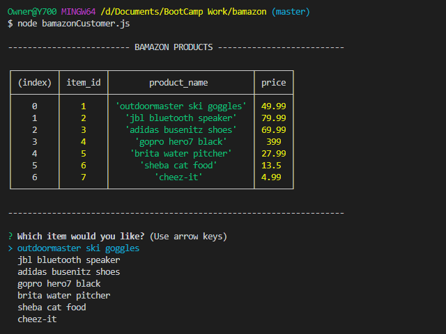
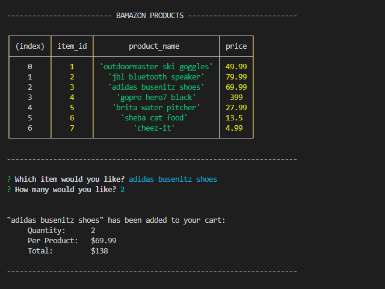
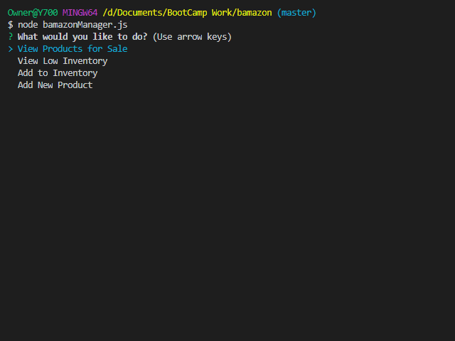

# Bamazon Node Market

## Bamazon Customer Menu

```
node bamazonCustomer.js
```

#### Running this application will first display all of the items available for sale in your terminal.

### Example of Bamazon Customer Menu:



#### Customer will then be asked to select the item and how many units they would like to buy.

### Example of Bamazon Purchase Menu:



#### Once the customer has placed the order, customer will be given the total cost of their purchase.

## Bamazon Manager Menu

```
node bamazonManager.js
```

#### Running this application will list a set of menu options:

- View Products for Sale
- View Low Inventory
- Add to Inventory
- Add New Product

### Example of Bamazon Manager Menu:


