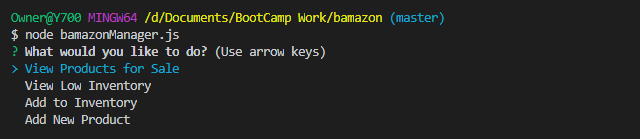
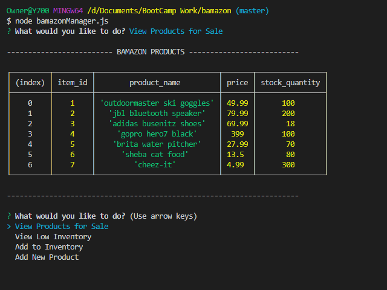

# Bamazon Node Market

## Bamazon Customer Menu

```
node bamazonCustomer.js
```

#### Running this application will first display all of the items available for sale in your terminal.

### Example of Bamazon Customer Menu:


#### Customer will then be asked to select the item and how many units they would like to buy.

### Example of Bamazon Purchase Menu:


#### Once the customer has placed the order, customer will be given the total cost of their purchase.

## Bamazon Manager Menu

```
node bamazonManager.js
```

#### Running this application will list a set of menu options:

- View Products for Sale
- View Low Inventory
- Add to Inventory
- Add New Product

### Example of Bamazon Manager Menu:



#### If a manager selects `View Products for Sale`, the app will list every available item.

### Example of View Products for Sale:



#### If a manager selects `View Low Inventory`, then it will list all items with an inventory count lower than five.

### Example of View Low Inventory:


#### If a manager selects `Add to Inventory`, your app will display a prompt that will let the manager "add more" of any item currently in the store.

### Example of Add to Inventory:


#### If a manager selects `Add New Product`, it will allow the manager to add a completely new product to the store.

### Example of Add New Product:


